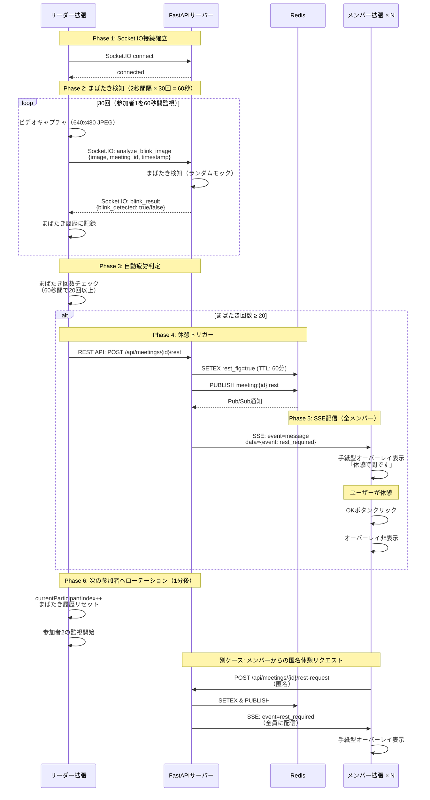
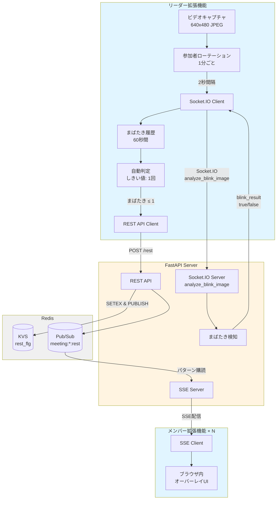

# ひとやすみ通信

<div align="center"> <h2>🚀 今すぐチェック！</h2> <p> <a href="https://drive.google.com/drive/folders/1pl616xqFoKouzJhqzKthTeSI5dReDHfI" target="_blank"><strong>📁 すべてのデモ・概要動画・.env はこの Google Drive にまとまっています</strong></a> <br/> <sub>（審査はまずここを開けばOK）</sub> </p> <p> <a href="https://drive.google.com/drive/folders/1pl616xqFoKouzJhqzKthTeSI5dReDHfI" target="_blank"></a> &nbsp; <a href="https://drive.google.com/drive/folders/1pl616xqFoKouzJhqzKthTeSI5dReDHfI" target="_blank"></a> </p> <hr style="width: 80%;"> <h3>📄 .env（拡張機能で<strong>必須</strong>）</h3> <p> <a href="https://drive.google.com/drive/folders/1pl616xqFoKouzJhqzKthTeSI5dReDHfI" target="_blank"><strong>.env の場所（Drive内）</strong></a><br/> <em>※ ルート直下に配置後、<code>node scripts/build-config.js</code> を実行して拡張機能が動作します。必ずご確認ください。</em> </p> </div> ::contentReference[oaicite:0]{index=0}

## 製品概要
### 背景(製品開発のきっかけ、課題等）

リモートワークが普及する中で、オンライン会議の長時間化や休憩不足が問題となっています。特に会議中に疲れを感じても「言い出しにくい」「」といった心理的ハードルがあり、結果として集中力の低下や健康リスクを引き起こすケースが増えています。

長時間のオンライン会議では、参加者が疲労していても休憩を取りづらい状況があります。個人の判断で休憩を取ることが難しく、会議の生産性が低下してしまう問題に着目しました。そこで、科学的根拠に基づき、誰もが自然に休憩を取れる仕組みを目指して本アプリを開発しました。

### 製品説明（具体的な製品の説明）

「ひとやすみ通信」は、Google Meetに対応したChrome拡張機能です。カメラ映像をもとにユーザーのまばたき（Eye Aspect Ratio: EAR）をリアルタイムで解析し、疲労度を判定します。

**主な機能:**
- **自動まばたき検知**: Socket.IOでリアルタイムにまばたきを検知（10FPS）
- **複数参加者対応**: 1分ごとに全参加者を巡回して疲労度を判定
- **自動休憩通知**: まばたきが少ない参加者を検知したら自動的に全員に休憩を促す
- **手紙型UI**: 疲労が検出されると、画面中央に「手紙が届くような演出」で休憩を促すUIが表示
- **匿名休憩申請**: 会議参加者は匿名で「休憩申請」を送信でき、他のメンバーに自然に休憩を提案可能

### 特長
#### 1. 特長1 - リアルタイム疲労検出

カメラ映像から顔を検出し、EAR（Eye Aspect Ratio）を算出。日本人の平均的な値（0.17）を基準として、まばたきが20回/分を超える場合は「疲労」と判定します。この科学的指標により、主観ではなく客観的な基準で休憩タイミングを判断します。

**技術的特徴:**
- Socket.IOによる双方向リアルタイム通信
- 2秒間隔で画像キャプチャ（640x480 JPEG、品質70%）
- 1分間で30回の検知を実施し、まばたき履歴を記録
- しきい値（1回以下）で自動的に休憩フラグを立てる

#### 2. 特長2 - 手紙型UIによる自然な休憩促進

疲労を検知すると、画面中央に手紙が届くようなアニメーションで「休憩しましょう」と表示します。強制的な停止ではなく、柔らかい演出でユーザーの心理的抵抗を軽減します。

**実装:**
- SSE（Server-Sent Events）による全参加者へのブロードキャスト配信
- ブラウザ内オーバーレイUIとElectronデスクトップオーバーレイの2つの表示方式
- フェードイン/フェードアウトのスムーズなアニメーション

#### 3. 特長3 - 匿名休憩申請機能
****
会議中でも匿名で休憩希望を送信可能。他の参加者には「誰かが休憩を提案しています」と通知され、全員が休みやすい雰囲気を自然に形成します。

**仕組み:**
- REST APIによる休憩リクエスト送信
- Redis Pub/Subによるイベント配信
- 個人を特定しない匿名システム

### ユースケース図



### 解決出来ること

- **長時間のオンライン会議による疲労や集中力低下を軽減**: 客観的指標に基づく自動休憩提案
- **休憩を切り出しづらい環境でも、匿名提案により心理的負担を緩和**: 誰でも気軽に休憩を提案可能
- **客観敵根拠に基づいた「最適な休憩タイミング」の提示**: EARアルゴリズムによる疲労判定
- **リモートワーク環境における健康的で持続可能な働き方の支援**: 会議の生産性向上と参加者の健康維持
- **会議中の疲労の蓄積を防止**: 1分ごとの参加者巡回監視により全員の状態を把握
- **適切なタイミングでの休憩促進**: 自動判定とリアルタイム通知による即座の対応

### 今後の展望

- **機械学習モデルの導入**: 根拠としてリモートワーク中の音声を解析して集中的かどうかの高度な根拠疲労度判定
- **個人別疲労度ダッシュボード**: 会議・メンバーごとの疲労度推移グラフと統計分析
- **Slack/Discord通知連携**: 外部サービスとの統合
- **カスタマイズ可能なしきい値設定UI**: ユーザーごとの疲労基準調整

### 注力したこと（こだわり等）

- **客観敵根拠に基づくアルゴリズム**: EAR（Eye Aspect Ratio）による客観的な疲労判定
- **心理的ハードルを下げるUI/UX**: 匿名性確保と客観的指標に基づく休憩の自動化
- **リアルタイム性の追求**: Socket.IOとSSEを組み合わせたハイブリッド型通信
- **プライバシー保護**: 画像データはサーバーに保存せず、検知結果（true/false）のみを記録
- **参加者全員の公平な監視**: 1分ごとのローテーションにより全員を順番に検知

## 開発技術
### 活用した技術
#### API・データ

**システム構成図:**



**REST API一覧:**

| メソッド | エンドポイント | 説明 |
|---------|---------------|------|
| POST | `/api/meetings/{meeting_id}/start` | 会議開始 |
| DELETE | `/api/meetings/{meeting_id}/end` | 会議終了 |
| POST | `/api/meetings/{meeting_id}/rest` | 休憩トリガー（自動/手動） |
| POST | `/api/meetings/{meeting_id}/rest-request` | 休憩希望（メンバーからの匿名リクエスト） |
| POST | `/api/meetings/{meeting_id}/page-info` | ページ情報送信 |
| GET | `/api/meetings/{meeting_id}/status` | 会議状態確認 |
| GET | `/health` | ヘルスチェック |
| GET | `/api/sse/events?meeting_id={id}` | SSEイベントストリーム接続 |

**Socket.IOイベント:**

クライアント → サーバー:
- `connect`: 接続確立
- `join_meeting`: 会議ルームに参加 `{ meeting_id }`
- `analyze_blink_image`: まばたき検知リクエスト `{ image, meeting_id, timestamp }`
- `leave_meeting`: 会議ルームから退出 `{ meeting_id }`
- `disconnect`: 切断

サーバー → クライアント:
- `blink_result`: まばたき検知結果 `{ blink_detected, server_timestamp, client_timestamp, status }`
- `page_info`: ページ情報 `{ meeting_id, title, url, timestamp }`
- `rest_required`: 休憩通知 `{ event, meeting_id, timestamp, message }`

**Redis データ構造:**

```
# 会議のアクティブ状態（TTL: 3時間）
SETEX meetings:{meeting_id}:active 10800 "true"

# 会議開始時刻（TTL: 3時間）
SETEX meetings:{meeting_id}:started_at 10800 "2025-10-17T10:00:00Z"

# 休憩フラグ（TTL: 60分）
SETEX meetings:{meeting_id}:rest_flg 3600 "true"

# 休憩開始時刻（TTL: 60分）
SETEX meetings:{meeting_id}:rest_started_at 3600 "2025-10-17T10:30:00Z"

# Pub/Sub（休憩開始通知）
PUBLISH meeting:{meeting_id}:rest '{"event":"rest_required","meeting_id":"abc123","timestamp":"2025-10-17T10:30:00Z","message":"休憩時間です"}'

# パターン購読
PSUBSCRIBE meeting:*:rest
```

**通信プロトコル:**
- **Server-Sent Events (SSE)**: サーバーからクライアントへのリアルタイムイベント配信（ハートビート30秒間隔）
- **Socket.IO**: WebSocketベースの双方向リアルタイム通信（画像送信とまばたき検知結果の返信）
- **Redis Pub/Sub**: イベント配信（meeting:{meeting_id}:rest チャンネル）
- **Redis KVS**: 会議状態管理（rest_flg、started_at等、TTL設定で自動削除）

#### フレームワーク・ライブラリ・モジュール

**フロントエンド:**
- Chrome Extension Manifest V3
- Vanilla JavaScript
- HTML / CSS
- Socket.IO Client（リアルタイム画像送信）

**バックエンド:**
- FastAPI（Python 3.11）- REST API + SSE + Socket.IOサーバー
- Uvicorn（ASGIサーバー）
- python-socketio（Socket.IOサーバー実装）
- sse-starlette（SSEサポート）
- redis-py（Redisクライアント）

**インフラ:**
- Docker / Docker Compose（ローカル開発環境）
- Railway（本番環境デプロイ）
- Redis 7（インメモリDB + Pub/Sub）

**将来実装予定:**
- MediaPipe Face Mesh（まばたき検知精度向上）
- HuBERT / WavLM（SSL）,wav2vec 2.0（音声表現を加えたの疲労判定）

#### デバイス

- **PC内蔵または外部Webカメラ**: まばたき検知用の映像入力
- **Google Chrome**: Chrome拡張機能の実行環境
- **Webカメラ（瞬き検知用）**: 640x480解像度での顔認識

### 独自技術
#### ハッカソンで開発した独自機能・技術

**1. 参加者ローテーション監視システム**
- 1分ごとに自動的に次の参加者に切り替えて全員を順番に監視
- 各参加者につき60秒間（30回の検知）のまばたき履歴を記録
- 実装: `extensions/leader/content.js` の `rotateToNextParticipant()` 関数

**2. Socket.IO + SSEハイブリッド通信アーキテクチャ**
- Socket.IO: Leader拡張 → サーバー（画像送信）とサーバー → Leader（検知結果）
- SSE: サーバー → Member拡張全員（休憩通知のブロードキャスト）
- Redis Pub/Subによるイベント配信の統合
- 実装: `server/main.py` の `analyze_blink_image` イベントハンドラと `/api/sse/events` エンドポイント

**3. 自動疲労判定アルゴリズム**
- 60秒間のまばたき履歴をリアルタイムで追跡
- しきい値（1回以下）で自動的に休憩フラグを立てる
- 参加者切り替え時に履歴をリセット
- 実装: `extensions/leader/content.js` の `triggerRestBreak()` 関数
- コミット: [52aec74](https://github.com/jphacks/os_2521/commit/52aec74) - 60秒サイクルのまばたき検出システムを実装

**4. プライバシー保護設計**
- 画像データはサーバーに保存せず、メモリ上でのみ処理
- まばたき検知結果（true/false）のみをクライアントに返信
- 匿名化された meeting_id のみで参加者を特定しない
- Redis TTL設定により自動的にデータを削除（会議: 3時間、休憩: 60分）

**特に力を入れた部分:**
- [extensions/leader/content.js](extensions/leader/content.js) - まばたき検知とローテーションロジック
- [server/main.py](server/main.py) - Socket.IOとSSEの統合実装
- コミット: [52aec74](https://github.com/jphacks/os_2521/commit/52aec74) - 60秒サイクルのまばたき検出システムを実装
