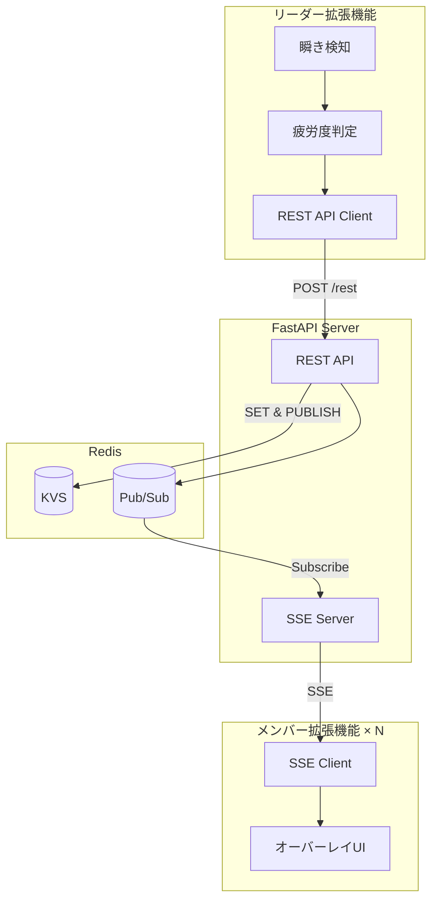
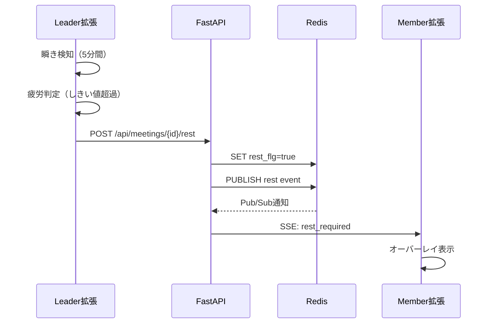

# 会議休憩管理システム 設計ドキュメント

## 概要

Google Meet会議中に参加者の疲労度を検知し、適切なタイミングで全メンバーに休憩を促すリアルタイムシステム。Chrome拡張機能とFastAPIサーバー、Redisを組み合わせたMVPアーキテクチャ。

---

## アーキテクチャ

### システム構成図



### 責務分離

| コンポーネント | 責務 |
|-------------|------|
| **Leader拡張** | 動画取得 → 瞬き検知 → 疲労度判定 → 休憩トリガー |
| **Member拡張** | SSE受信 → 休憩UI表示 |
| **FastAPI** | REST API + SSE配信 + Pub/Sub管理 |
| **Redis** | 状態管理（KVS）+ イベント配信（Pub/Sub）|

---

## データ設計

### Redis キー設計

```redis
# 休憩フラグ（TTL: 60分）
SET meetings:{meeting_id}:rest_flg "true" EX 3600

# 休憩開始時刻
SET meetings:{meeting_id}:rest_started_at "2025-10-17T10:30:00Z" EX 3600

# Pub/Sub（休憩開始通知）
PUBLISH meeting:{meeting_id}:rest '{"event":"rest_required","duration":300}'
```

### API設計

```python
# REST API
POST   /api/meetings/{meeting_id}/rest      # 休憩トリガー
POST   /api/meetings/{meeting_id}/rest/end  # 休憩終了
GET    /api/meetings/{meeting_id}/status    # 状態確認

# SSE
GET    /api/sse/events?meeting_id={id}      # イベントストリーム接続
```

### SSEメッセージ形式

```json
{
  "event": "rest_required",
  "data": {
    "meeting_id": "abc123",
    "timestamp": "2025-10-17T10:30:00Z",
    "duration": 300,
    "message": "休憩時間です"
  }
}
```

---

## 主要シーケンス

### 休憩トリガーフロー



---

## 主要コンポーネント実装

### 1. Leader拡張機能

#### 疲労度判定ロジック


---

### 2. Member拡張機能

#### SSE接続管理


### 3. FastAPI Server

#### SSEエンドポイント（正しい実装）


#### 休憩トリガーAPI

---

## セキュリティ

### 1. API認証

```python
from fastapi import Security, HTTPException
from fastapi.security import APIKeyHeader
import os

api_key_header = APIKeyHeader(name="X-API-Key")
API_KEY = os.getenv("API_KEY", "your-secret-key")

async def verify_api_key(key: str = Security(api_key_header)):
    if key != API_KEY:
        raise HTTPException(status_code=403, detail="Invalid API Key")
    return key
```

### 2. CORS設定

```python
from fastapi.middleware.cors import CORSMiddleware

ALLOWED_EXTENSION_IDS = os.getenv("ALLOWED_EXTENSION_IDS", "").split(",")

app.add_middleware(
    CORSMiddleware,
    allow_origins=[f"chrome-extension://{eid}" for eid in ALLOWED_EXTENSION_IDS],
    allow_credentials=True,
    allow_methods=["GET", "POST"],
    allow_headers=["X-API-Key", "Content-Type"],
)
```

### 3. データ保護

- **ビデオデータは送信しない**: 瞬き検知はローカル実行
- **匿名化ID**: `meeting_id`のみで参加者を特定しない
- **TTL設定**: Redisデータは60分で自動削除
- **最小限のデータ**: 瞬き回数のみを送信

---

## デプロイ

### Docker Compose（ローカル開発）

```yaml
version: '3.8'

services:
  redis:
    image: redis:7-alpine
    ports:
      - "6379:6379"
    command: redis-server --appendonly yes

  api:
    build: ./server
    ports:
      - "8000:8000"
    environment:
      REDIS_URL: redis://redis:6379
      API_KEY: ${API_KEY}
      ALLOWED_EXTENSION_IDS: ${ALLOWED_EXTENSION_IDS}
    depends_on:
      - redis
    command: uvicorn app.main:app --host 0.0.0.0 --reload
```

### 起動手順

```bash
# 1. 環境変数設定
cp .env.example .env
# .envにAPI_KEYとALLOWED_EXTENSION_IDSを設定

# 2. サーバー起動
docker-compose up -d

# 3. 拡張機能インストール
# chrome://extensions/
# 「デベロッパーモード」有効化
# 「パッケージ化されていない拡張機能を読み込む」
# extensions/leader と extensions/member を選択
```

---

## フォルダ構成

```
meeting-rest-system/
├── doc/
│   ├── design.md               # この設計ドキュメント
│   └── requirement.md          # 要件定義
│
├── extensions/
│   ├── leader/                 # リーダー用
│   │   ├── manifest.json
│   │   ├── content.js          
│   │   ├── popup.html          
│   │   ├── popup.js            
│   │   ├── blink-detector.js   
│   │   ├── fatigue-judge.js    
│   │   └── api-client.js       
│   │
│   └── member/                 # メンバー用
│       ├── manifest.json
│       ├── background.js
│       ├── content.js
│       ├── sse-client.js
│       └── overlay-ui.js
│
├── server/                     # FastAPI
│   ├── app/
│   │   ├── main.py
│   │   ├── config.py
│   │   ├── redis_client.py
│   │   └── api/
│   │       ├── meetings.py
│   │       └── events.py
│   ├── requirements.txt
│   └── Dockerfile
│
├── docker-compose.yml
├── .env.example
└── README.md
```

---

## MVP実装ロードマップ

### Phase 1: 基本機能
- [ ] Leader: 瞬き検知ロジック（MediaPipe Face Mesh統合）
- [ ] Leader: 疲労度判定アルゴリズム
- [ ] Leader: API通信実装
- [ ] Server: REST API実装
- [ ] Server: Redis接続

### Phase 2: リアルタイム配信
- [ ] Server: SSEエンドポイント実装
- [ ] Server: Redis Pub/Sub実装
- [ ] Member: SSE接続クライアント
- [ ] Member: オーバーレイUI実装


---

## 将来の拡張（参考）

- 高精度瞬き検知（MediaPipe Face Mesh）
- 個人別疲労度ダッシュボード
- Slack/Discord通知連携
- 会議品質レポート（疲労度推移グラフ）
- Kubernetes/Cloud Run デプロイ
