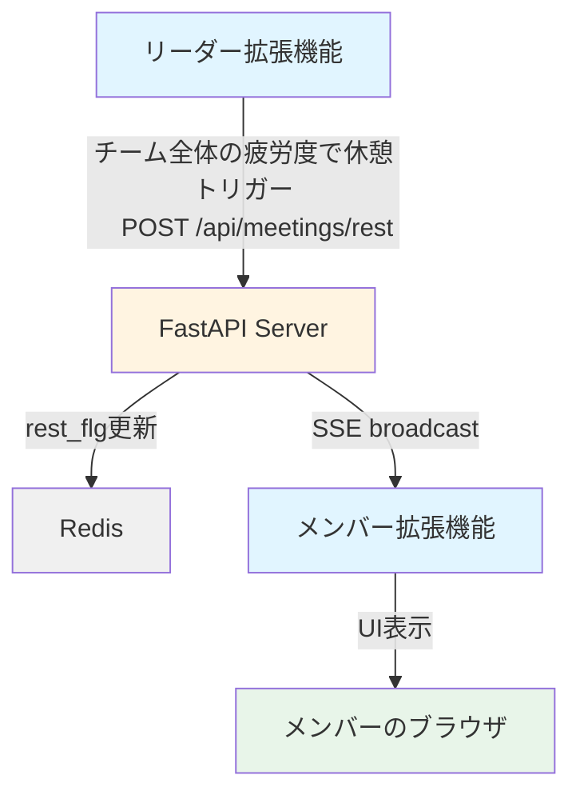
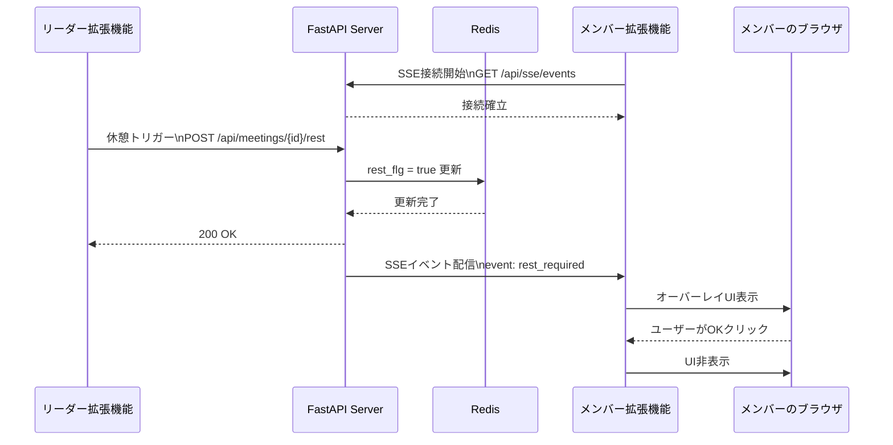

# 会議休憩管理システム要件定義

## 概要
Google Meet会議中に、リーダーが休憩を通知し、全メンバーに休憩UIを表示するシンプルなシステムです。
ハッカソンで実装可能なMVPに絞っています。

## システム構成



### シーケンス図


## 技術スタック
- Chrome Extension Manifest V3
- FastAPI（Python）
- Redis（インメモリDB）
- Server-Sent Events (SSE)
- Vanilla JavaScript（Content Script）
- シンプルなHTML/CSS（オーバーレイUI）

## ハッカソンスコープ

### 実装する機能
1. リーダーがメンバー全員の疲労度（**瞬き数の検知**）の習得
2. サーバーがrest_flgを更新しSSEで配信
3. メンバー全員に休憩オーバーレイを表示
4. 基本的な会議ID管理

### 実装しない機能（後回し）
- 自動瞬き検出（複雑すぎる）
- 高度なしきい値判定
- 複数会議の同時管理
- 履歴の長期保存と分析
- 詳細なエラーハンドリング
- 認証・セキュリティ
- パフォーマンスSLO

## 要件

### 要件 1: リーダー拡張機能（休憩トリガー）
**ユーザーストーリー**: ​まば​たきなどの​客観指標で​「今、​休むべき」を​判断し、​強制力の​ある​休憩画面で​短い​ブレイクを​実行させる​全員に休憩を通知したい。

**受入基準**:
- Google Meet画面にボタンを表示する
- ボタンクリックでサーバーに `POST /api/meetings/{meeting_id}/rest` を送信する
- 送信成功したら簡単なフィードバックを表示する

### 要件 2: サーバー側の休憩管理
**ユーザーストーリー**: システムとして、休憩リクエストを受け取り、全員に配信したい。

**受入基準**:
- `POST /api/meetings/{meeting_id}/rest` でrest_flgをtrueに更新する
- Redisに更新日時を記録する
- SSE接続中の全クライアントに通知を配信する

### 要件 3: データストア（Redis）
**データ構造**:
```
キー: meeting:{meeting_id}
タイプ: Hash
フィールド:
  - rest_flg: "true" | "false"
  - updated_at: ISO8601形式のタイムスタンプ

例:
HSET meeting:abc123 rest_flg "true"
HSET meeting:abc123 updated_at "2025-10-17T10:30:00Z"

取得:
HGETALL meeting:abc123
```

**TTL設定**:
- 会議データは24時間後に自動削除（EXPIRE meeting:{meeting_id} 86400）
- これにより古いデータの自動クリーンアップが可能

**Redis接続情報**:
- デフォルト: localhost:6379
- 環境変数で設定可能（REDIS_HOST, REDIS_PORT, REDIS_PASSWORD）

### 要件 4: SSEによるリアルタイム配信
**ユーザーストーリー**: システムとして、休憩通知をリアルタイムで配信したい。

**受入基準**:
- `GET /api/sse/events?meeting_id={id}` でSSE接続を確立する
- rest_flgがtrueになったら以下のメッセージを送信する:
```json
{
  "event": "rest_required",
  "meeting_id": "abc123",
  "timestamp": "2025-10-17T10:30:00Z"
}
```
- 基本的なハートビート（30秒間隔）を実装する

### 要件 5: メンバー拡張機能（UI表示）
**ユーザーストーリー**: 会議メンバー全員に、休憩させる。

**受入基準**:
- `rest_required`イベントを受信したらオーバーレイUIを表示する
- オーバーレイには以下を含む:
  - 半透明背景
  - 「休憩時間です」メッセージ
  - 「OK」ボタン
- ボタンクリックでフェードアウトして非表示にする


## 追加検討事項（時間があれば）
- プライバシーの観点対応
- オンラインミーティングで途中抜け等の場合の処理考える
- Redis Pub/Subを使ったSSEの最適化

## 成功基準
- 5人の参加者で同時にテストして正常動作する
- 基本的なエラー（サーバーダウン等）で致命的なクラッシュが発生しない
