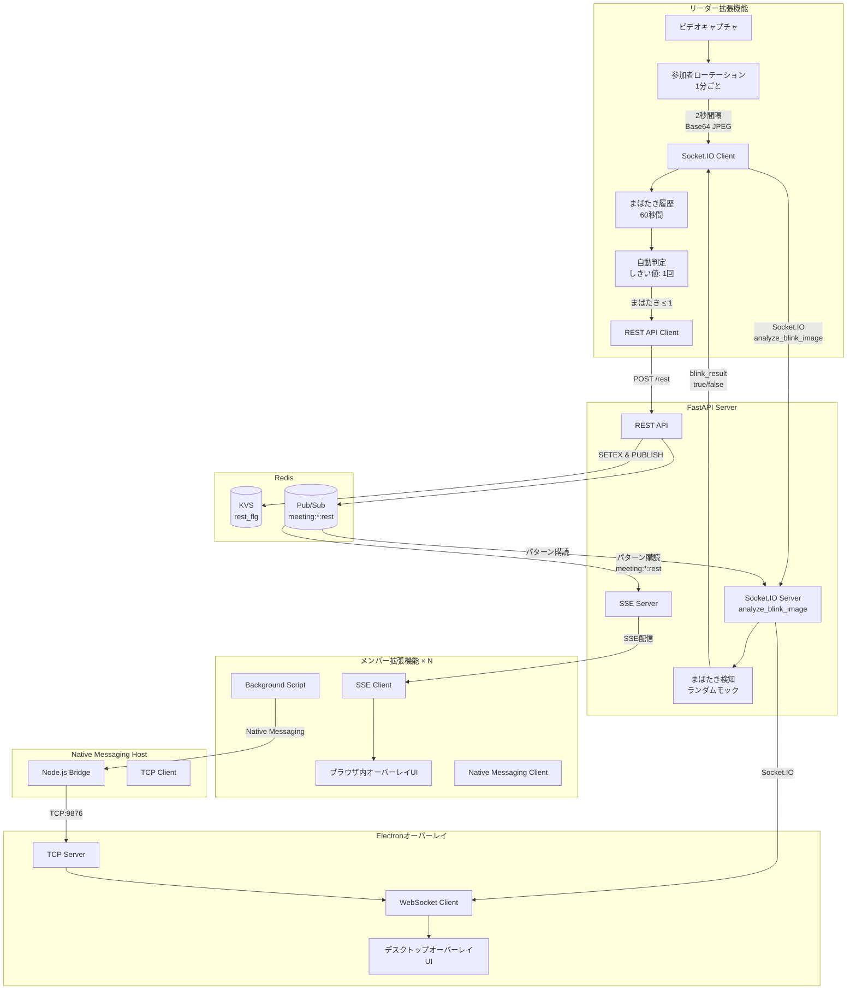
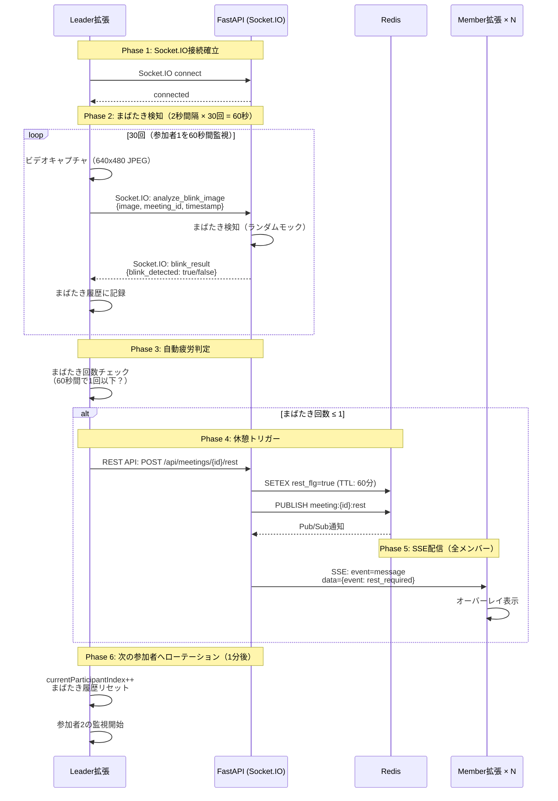

# 会議休憩管理システム 設計ドキュメント

## 概要

Google Meet会議中に参加者のまばたきをリアルタイムで検知して疲労度を判定し、適切なタイミングで全メンバーに休憩を促すシステム。Socket.IOによる双方向通信とSSEによるブロードキャスト配信を組み合わせたハイブリッド型リアルタイムシステム。Chrome拡張機能、FastAPIサーバー、Redisを組み合わせたMVPアーキテクチャ。

---

## アーキテクチャ

### システム構成図



### 責務分離

| コンポーネント | 責務 |
|-------------|------|
| **Leader拡張** | ビデオキャプチャ（640x480 JPEG） → Socket.IO送信（2秒間隔） → まばたき履歴記録（60秒） → 自動疲労判定（しきい値: 1回） → 参加者ローテーション（1分ごと） → REST API休憩トリガー |
| **Member拡張 (Content)** | SSE受信 → ブラウザ内休憩UI表示 → 休憩希望ボタン |
| **Member拡張 (Background)** | Native Messaging経由でElectronに接続情報送信 |
| **Native Messaging Host** | Chrome拡張機能とElectron間のブリッジ (TCP) |
| **Electronオーバーレイ** | TCPサーバー起動 → Socket.IO接続 → デスクトップオーバーレイ表示 |
| **FastAPI** | REST API + SSE配信 + Socket.IO双方向通信（まばたき検知） + Redis Pub/Sub管理 |
| **Redis** | 状態管理（KVS: rest_flg等）+ イベント配信（Pub/Sub: meeting:*:rest）|

---

## データ設計

### Redis キー設計

```redis
# 会議のアクティブ状態（TTL: 3時間）
SETEX meetings:{meeting_id}:active 10800 "true"

# 会議開始時刻（TTL: 3時間）
SETEX meetings:{meeting_id}:started_at 10800 "2025-10-17T10:00:00Z"

# 休憩フラグ（TTL: 60分）
SETEX meetings:{meeting_id}:rest_flg 3600 "true"

# 休憩開始時刻（TTL: 60分）
SETEX meetings:{meeting_id}:rest_started_at 3600 "2025-10-17T10:30:00Z"

# Pub/Sub（休憩開始通知）
PUBLISH meeting:{meeting_id}:rest '{"event":"rest_required","meeting_id":"abc123","timestamp":"2025-10-17T10:30:00Z","message":"休憩時間です"}'

# パターン購読
PSUBSCRIBE meeting:*:rest
```

### API設計

```python
# REST API
POST   /api/meetings/{meeting_id}/start          # 会議開始
DELETE /api/meetings/{meeting_id}/end            # 会議終了
POST   /api/meetings/{meeting_id}/rest           # 休憩トリガー（自動/手動）
POST   /api/meetings/{meeting_id}/rest-request   # 休憩希望（メンバーからの匿名リクエスト）
POST   /api/meetings/{meeting_id}/page-info      # ページ情報送信
GET    /api/meetings/{meeting_id}/status         # 状態確認
GET    /health                                    # ヘルスチェック

# SSE（Server-Sent Events）
GET    /api/sse/events?meeting_id={id}           # イベントストリーム接続

# Socket.IO（双方向通信）
接続: http://localhost:8000/socket.io/?EIO=4&transport=polling
イベント（クライアント→サーバー）:
  - connect                                      # 接続
  - join_meeting { meeting_id }                  # 会議ルームに参加
  - analyze_blink_image { image, meeting_id, timestamp }  # まばたき検知リクエスト
  - leave_meeting { meeting_id }                 # 会議ルームから退出
  - disconnect                                   # 切断

イベント（サーバー→クライアント）:
  - blink_result { blink_detected, server_timestamp, client_timestamp, status }  # まばたき検知結果
  - page_info { meeting_id, title, url, timestamp }  # ページ情報
  - rest_required { event, meeting_id, timestamp, message }  # 休憩通知
```

### SSEメッセージ形式

**接続確立時**:
```json
{
  "event": "connected",
  "data": {
    "meeting_id": "abc123",
    "timestamp": "2025-10-17T10:30:00Z"
  }
}
```

**休憩通知**:
```json
{
  "event": "message",
  "data": {
    "event": "rest_required",
    "meeting_id": "abc123",
    "timestamp": "2025-10-17T10:30:00Z",
    "message": "休憩時間です"
  }
}
```

**ハートビート（30秒間隔）**:
```json
{
  "event": "heartbeat",
  "data": {
    "timestamp": "2025-10-17T10:30:00Z"
  }
}
```

### Socket.IOメッセージ形式

**クライアント→サーバー（まばたき検知リクエスト）**:
```json
{
  "image": "data:image/jpeg;base64,/9j/4AAQSkZJRg...",
  "meeting_id": "abc123",
  "timestamp": "2025-10-17T10:30:00Z"
}
```

**サーバー→クライアント（まばたき検知結果）**:
```json
{
  "blink_detected": true,
  "server_timestamp": "2025-10-17T10:30:01Z",
  "client_timestamp": "2025-10-17T10:30:00Z",
  "status": "ok"
}
```

---

## 主要シーケンス

### まばたき検知と自動休憩トリガーフロー



---

## 主要コンポーネント実装

### 1. Leader拡張機能（extensions/leader/content.js）

#### まばたき検知アルゴリズム

**参加者ローテーション**:
```javascript
// 設定
const BLINK_CHECK_INTERVAL = 2000;           // 2秒ごとに検知
const PARTICIPANT_ROTATION_INTERVAL = 60000; // 1分ごとに参加者切り替え
const TRACKING_WINDOW = 60000;               // 60秒間の履歴を保持
const BLINK_THRESHOLD = 1;                   // しきい値: 1回以下で休憩

// グローバル変数
let currentParticipantIndex = 0;             // 現在監視中の参加者インデックス
let blinkHistory = [];                       // まばたき履歴（60秒分）

// 参加者ローテーション
function rotateToNextParticipant() {
  const videos = findCandidateVideos();
  currentParticipantIndex = (currentParticipantIndex + 1) % videos.length;
  blinkHistory = [];  // 履歴をリセット
}

// 1分ごとに次の参加者に切り替え
setInterval(rotateToNextParticipant, PARTICIPANT_ROTATION_INTERVAL);
```

**画像キャプチャとSocket.IO送信**:
```javascript
function captureAndAnalyze() {
  const videos = findCandidateVideos();
  const video = videos[currentParticipantIndex];

  // 640x480のJPEGにエンコード（品質70%）
  const canvas = document.createElement('canvas');
  canvas.width = 640;
  canvas.height = 480;
  const ctx = canvas.getContext('2d');
  ctx.drawImage(video, 0, 0, 640, 480);
  const imageData = canvas.toDataURL('image/jpeg', 0.7);

  // Socket.IOで送信
  socket.emit('analyze_blink_image', {
    image: imageData,
    meeting_id: meetingId,
    timestamp: new Date().toISOString()
  });
}

// 2秒ごとに実行
setInterval(captureAndAnalyze, BLINK_CHECK_INTERVAL);
```

**まばたき履歴管理と自動判定**:
```javascript
socket.on('blink_result', (data) => {
  const now = Date.now();

  // 履歴に追加
  blinkHistory.push({
    detected: data.blink_detected,
    timestamp: now
  });

  // 60秒より古いデータを削除
  blinkHistory = blinkHistory.filter(
    record => now - record.timestamp <= TRACKING_WINDOW
  );

  // まばたき回数をカウント
  const blinkCount = blinkHistory.filter(r => r.detected).length;

  // しきい値チェック（1回以下なら休憩トリガー）
  if (blinkCount <= BLINK_THRESHOLD) {
    triggerRestBreak();
  }
});

async function triggerRestBreak() {
  const response = await fetch(`${API_BASE_URL}/api/meetings/${meetingId}/rest`, {
    method: 'POST',
    headers: { 'Content-Type': 'application/json' }
  });

  if (response.ok) {
    blinkHistory = [];  // 履歴をリセット
  }
}
```

---

### 2. Member拡張機能（extensions/member/content.js）

#### SSE接続管理

```javascript
const eventSource = new EventSource(
  `${API_BASE_URL}/api/sse/events?meeting_id=${meetingId}`
);

eventSource.addEventListener('message', (event) => {
  const data = JSON.parse(event.data);

  if (data.event === 'rest_required') {
    showRestOverlay(data.message);
  }
});

eventSource.addEventListener('heartbeat', (event) => {
  console.log('Heartbeat received:', event.data);
});

eventSource.onerror = (error) => {
  console.error('SSE error:', error);
  // 再接続ロジック
};
```

---

### 3. FastAPI Server（server/main.py）

#### Socket.IO設定

```python
import socketio
from fastapi import FastAPI

# Socket.IOサーバー作成
sio = socketio.AsyncServer(
    async_mode='asgi',
    cors_allowed_origins='*',  # 全オリジン許可
    logger=True,
    engineio_logger=True
)

# Socket.IOをASGIアプリとしてマウント
socket_app = socketio.ASGIApp(sio, app)
```

#### まばたき検知イベントハンドラ

```python
@sio.event
async def analyze_blink_image(sid, data):
    """
    まばたき検知用画像を受信してランダムな結果を返す
    """
    meeting_id = data.get('meeting_id')
    image_data = data.get('image')
    client_timestamp = data.get('timestamp')

    # ランダムにtrue/falseを生成（モック実装）
    blink_detected = random.choice([True, False])

    # 結果を返送
    result = {
        'blink_detected': blink_detected,
        'server_timestamp': datetime.utcnow().isoformat(),
        'client_timestamp': client_timestamp,
        'status': 'ok'
    }

    await sio.emit('blink_result', result, room=sid)
    return result
```

#### SSEエンドポイント

```python
from sse_starlette.sse import EventSourceResponse

@app.get("/api/sse/events")
async def sse_events(meeting_id: str):
    """SSE（Server-Sent Events）エンドポイント"""
    async def event_generator() -> AsyncGenerator[dict, None]:
        pubsub_client = redis.Redis(...)
        pubsub = pubsub_client.pubsub()

        # Pub/Subチャンネルを購読
        await pubsub.subscribe(f"meeting:{meeting_id}:rest")

        # 接続確立メッセージ
        yield {
            "event": "connected",
            "data": json.dumps({
                "meeting_id": meeting_id,
                "timestamp": datetime.utcnow().isoformat()
            })
        }

        # メッセージをストリーミング
        while True:
            message = await pubsub.get_message(ignore_subscribe_messages=True)
            if message and message['type'] == 'message':
                yield {
                    "event": "message",
                    "data": message['data']
                }

            # ハートビート（30秒間隔）
            await asyncio.sleep(1.0)

    return EventSourceResponse(event_generator())
```

#### 休憩トリガーAPI

```python
@app.post("/api/meetings/{meeting_id}/rest")
async def trigger_rest(meeting_id: str):
    """休憩をトリガーする"""
    timestamp = datetime.utcnow().isoformat()

    # rest_flgを設定（TTL: 60分）
    await redis_client.setex(
        f"meetings:{meeting_id}:rest_flg",
        3600,
        "true"
    )

    # Redis Pub/Subでイベントを発行
    event_data = {
        "event": "rest_required",
        "meeting_id": meeting_id,
        "timestamp": timestamp,
        "message": "休憩時間です"
    }
    await redis_client.publish(
        f"meeting:{meeting_id}:rest",
        json.dumps(event_data)
    )

    return {"status": "ok", "meeting_id": meeting_id, "timestamp": timestamp}
```

---

## セキュリティ

### 1. API認証

```python
from fastapi import Security, HTTPException
from fastapi.security import APIKeyHeader
import os

api_key_header = APIKeyHeader(name="X-API-Key")
API_KEY = os.getenv("API_KEY", "your-secret-key")

async def verify_api_key(key: str = Security(api_key_header)):
    if key != API_KEY:
        raise HTTPException(status_code=403, detail="Invalid API Key")
    return key
```

### 2. CORS設定

```python
from fastapi.middleware.cors import CORSMiddleware

ALLOWED_EXTENSION_IDS = os.getenv("ALLOWED_EXTENSION_IDS", "").split(",")

app.add_middleware(
    CORSMiddleware,
    allow_origins=[f"chrome-extension://{eid}" for eid in ALLOWED_EXTENSION_IDS],
    allow_credentials=True,
    allow_methods=["GET", "POST"],
    allow_headers=["X-API-Key", "Content-Type"],
)
```

### 3. データ保護

- **画像データの取り扱い**: Base64エンコードされた画像をSocket.IOで送信するが、サーバー側で保存しない（メモリ上でのみ処理）
- **まばたき検知結果のみ記録**: true/falseの結果のみを返し、画像データは破棄
- **匿名化ID**: `meeting_id`のみで参加者を特定しない（個人情報なし）
- **TTL設定**: Redisデータは自動削除
  - 会議データ: 3時間（10800秒）
  - 休憩フラグ: 60分（3600秒）
- **最小限のデータ**: まばたき検知結果のみを記録
- **Transport制限**: Socket.IOはPollingのみ使用（WebSocketは無効化）

---

## デプロイ

### Docker Compose（ローカル開発）

```yaml
version: '3.8'

services:
  redis:
    image: redis:7-alpine
    ports:
      - "6379:6379"
    command: redis-server --appendonly yes
    volumes:
      - redis-data:/data

  api:
    build: ./server
    ports:
      - "8000:8000"
    environment:
      REDIS_HOST: redis
      REDIS_PORT: 6379
      REDIS_PASSWORD: ${REDIS_PASSWORD:-}
    depends_on:
      - redis
    # 重要: socket_appを使用してSocket.IOサポートを有効化
    command: uvicorn main:socket_app --host 0.0.0.0 --port 8000 --reload

volumes:
  redis-data:
```

### 起動手順

```bash
# 1. サーバー起動
docker-compose up -d

# 2. ヘルスチェック
curl http://localhost:8000/health

# 3. ログ確認
docker-compose logs -f api

# 4. 拡張機能インストール
# chrome://extensions/
# 「デベロッパーモード」有効化
# 「パッケージ化されていない拡張機能を読み込む」
# extensions/leader と extensions/member を選択
```

### Railway本番環境デプロイ

**必須設定**:
1. Railwayプロジェクト作成
2. Redis Pluginを追加
3. 環境変数設定:
   ```
   REDIS_HOST: redis.railway.internal
   REDIS_PORT: 6379
   PORT: (Railwayが自動設定)
   ```
4. `railway.json`に基づいて自動デプロイ
5. Dockerfileの`CMD`で`${PORT:-8000}`を使用

詳細は [infra/deploy.md](../infra/deploy.md) を参照。

---

## フォルダ構成

```
meeting-rest-system/
├── doc/
│   ├── README.md               # ドキュメントトップ
│   ├── spec/
│   │   ├── design.md           # この設計ドキュメント
│   │   ├── requirement.md      # 要件定義
│   │   └── tasks.md            # タスク管理
│   └── infra/
│       └── deploy.md           # デプロイガイド
│
├── extensions/
│   ├── leader/                 # リーダー用
│   │   ├── manifest.json
│   │   ├── content.js
│   │   ├── popup.html
│   │   └── popup.js
│   │
│   └── member/                 # メンバー用
│       ├── manifest.json
│       ├── background.js       # Native Messaging管理
│       ├── content.js          # SSE接続・ブラウザ内UI
│       ├── popup.html
│       └── popup.js
│
├── overlay/                    # Electronオーバーレイ
│   ├── README.md              # 使用方法
│   ├── SETUP.md               # セットアップガイド
│   ├── main.js                # Electronメインプロセス (TCP Server)
│   ├── preload.js             # プリロードスクリプト
│   ├── renderer.js            # レンダラープロセス
│   ├── overlay.html           # オーバーレイUI
│   └── native-host.js         # Native Messaging Host
│
├── scripts/
│   ├── build-config.js        # 設定ビルド
│   └── install-native-host.js # Native Hostインストール
│
├── server/                     # FastAPI
│   ├── main.py                # メインアプリケーション
│   ├── requirements.txt
│   ├── Dockerfile
│   └── README.md
│
├── test/
│   ├── index.html             # テストコンソール
│   └── README.md
│
├── docker-compose.yml
├── package.json               # Node.js依存関係
├── .env.example
└── README.md
```

---

## MVP実装ロードマップ

### Phase 1: 基本機能 ✅（完了）
- [x] Leader: Socket.IO接続実装
- [x] Leader: ビデオキャプチャとBase64エンコード
- [x] Leader: Socket.IOでの画像送信（2秒間隔）
- [x] Leader: まばたき履歴管理（60秒間）
- [x] Leader: 自動疲労判定アルゴリズム（しきい値: 1回）
- [x] Leader: 参加者ローテーション（1分ごと）
- [x] Leader: REST API休憩トリガー実装
- [x] Server: Socket.IO設定（CORS、Polling transport）
- [x] Server: まばたき検知イベントハンドラ（ランダムモック）
- [x] Server: REST API実装
- [x] Server: Redis接続

### Phase 2: リアルタイム配信 ✅（完了）
- [x] Server: SSEエンドポイント実装
- [x] Server: Redis Pub/Sub実装
- [x] Server: Redis→Socket.IOブリッジ実装
- [x] Member: SSE接続クライアント
- [x] Member: ブラウザ内オーバーレイUI実装
- [x] Member: 休憩希望ボタン実装

### Phase 3: Electronオーバーレイ ✅（完了）
- [x] Electron: メインプロセス実装
- [x] Electron: デスクトップオーバーレイUI実装
- [x] Electron: Socket.IO接続
- [x] Electron: TCP Server実装（Native Messaging Host受信）
- [x] Native Messaging Host: Node.jsブリッジ実装
- [x] Member拡張: Background Script実装
- [x] Member拡張: Native Messaging Client実装
- [x] インストールスクリプト: native-host登録ツール

### Phase 4: 本番環境デプロイ ✅（完了）
- [x] Dockerfile作成（PORT環境変数対応）
- [x] railway.json作成
- [x] .dockerignore作成
- [x] ヘルスチェックエンドポイント強化
- [x] Railway Redis設定
- [x] 本番環境CORS設定
- [x] Socket.IO Polling transport設定
- [x] デプロイガイド作成

---

## Native Messaging アーキテクチャ詳細

### データフロー

```
1. ユーザーがMember拡張機能で「接続」をクリック
   ↓
2. Content Script → Background Script (chrome.runtime.sendMessage)
   データ: { action: 'connect_overlay', meetingId, apiUrl }
   ↓
3. Background Script → Native Messaging Host (chrome.runtime.connectNative)
   データ: { type: 'connect', meetingId, apiBaseUrl }
   ↓
4. Native Messaging Host → Electronアプリ (TCP Socket localhost:9876)
   データ: JSON string + '\n'
   ↓
5. Electronアプリ: 設定を更新してSocket.IO接続開始
   ↓
6. Socket.IO → FastAPIサーバー
   イベント: join_meeting { meeting_id }
   ↓
7. サーバーからpage_info, rest_requiredイベント受信
   ↓
8. Electronオーバーレイに表示
```

### セキュリティ考慮事項

1. **Native Messaging Host マニフェスト**
   - `allowed_origins`: 特定の拡張機能IDのみ許可
   - パスの検証: 実行ファイルパスの厳密な指定

2. **TCP通信**
   - localhost (127.0.0.1) のみバインド
   - ポート9876は固定（ファイアウォール設定推奨）

3. **データ検証**
   - JSONパース時のエラーハンドリング
   - 不正なメッセージは無視

---

## 将来の拡張（参考）

### まばたき検知の精度向上
- MediaPipe Face Meshによる実際のまばたき検知
- 機械学習モデルの導入（TensorFlow.js）
- Eye Aspect Ratio (EAR) アルゴリズムの実装
- リアルタイム顔認識と目の検出

### 機能拡張
- 個人別疲労度ダッシュボード
- Slack/Discord通知連携
- 会議品質レポート（疲労度推移グラフ）
- まばたき回数の統計分析
- カスタマイズ可能なしきい値設定UI
- 複数会議の同時管理

### インフラ拡張
- Kubernetes/Cloud Run デプロイ
- Native Messagingの暗号化通信
- WebSocketサポート（403エラー解決後）
- CDN経由での静的ファイル配信

### セキュリティ強化
- API認証（API Key、OAuth）
- CORS設定の厳格化（本番環境）
- 画像データの暗号化
- 監査ログの記録
