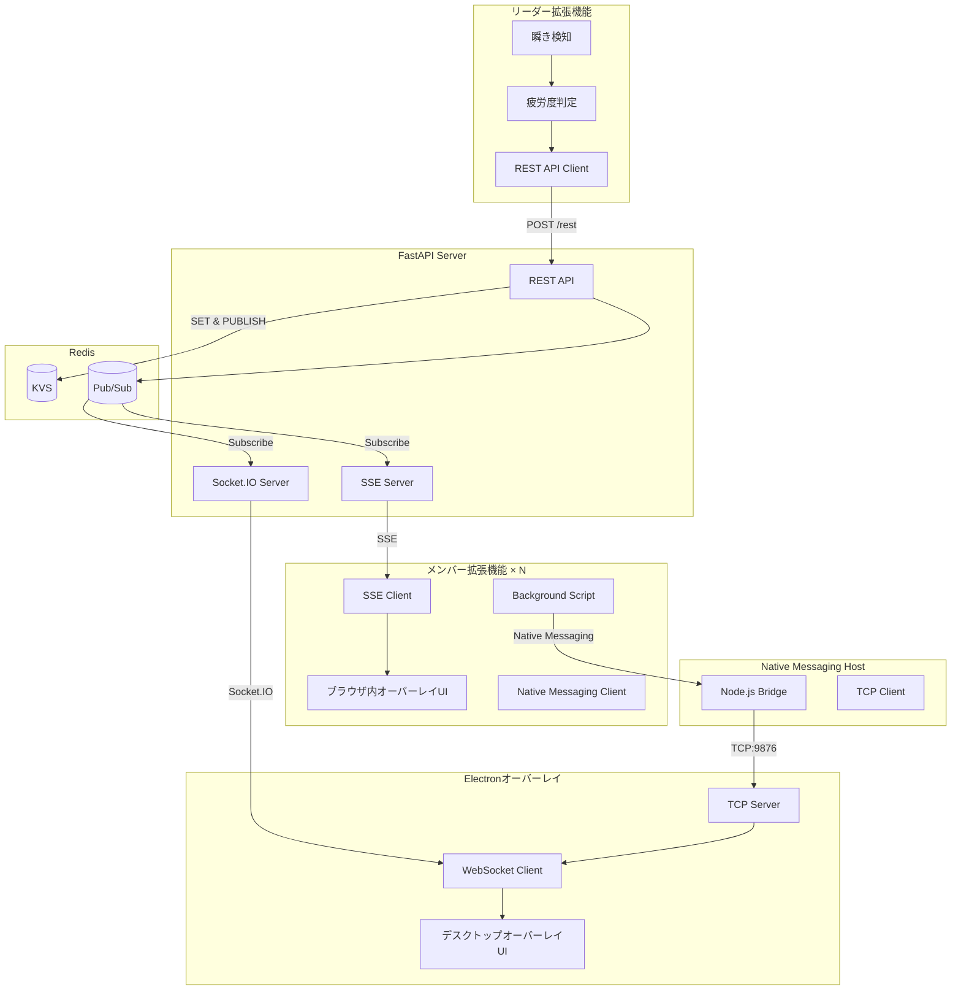
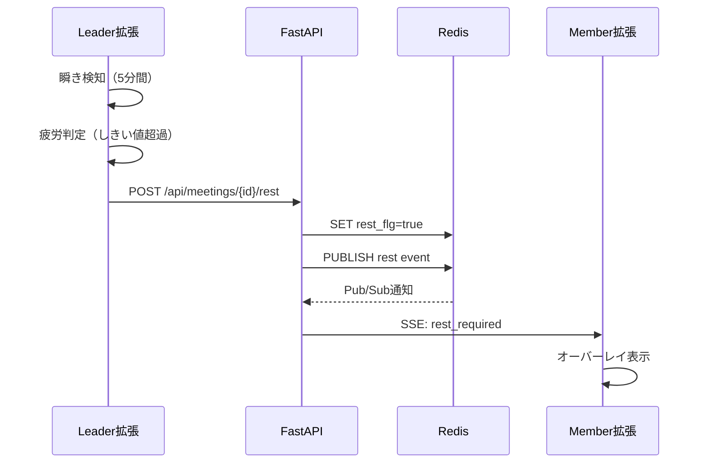

# 会議休憩管理システム 設計ドキュメント

## 概要

Google Meet会議中に参加者の疲労度を検知し、適切なタイミングで全メンバーに休憩を促すリアルタイムシステム。Chrome拡張機能とFastAPIサーバー、Redisを組み合わせたMVPアーキテクチャ。

---

## アーキテクチャ

### システム構成図



### 責務分離

| コンポーネント | 責務 |
|-------------|------|
| **Leader拡張** | 動画取得 → 瞬き検知 → 疲労度判定 → 休憩トリガー |
| **Member拡張 (Content)** | SSE受信 → ブラウザ内休憩UI表示 |
| **Member拡張 (Background)** | Native Messaging経由でElectronに接続情報送信 |
| **Native Messaging Host** | Chrome拡張機能とElectron間のブリッジ (TCP) |
| **Electronオーバーレイ** | TCPサーバー起動 → Socket.IO接続 → デスクトップオーバーレイ表示 |
| **FastAPI** | REST API + SSE配信 + Socket.IO配信 + Pub/Sub管理 |
| **Redis** | 状態管理（KVS）+ イベント配信（Pub/Sub）|

---

## データ設計

### Redis キー設計

```redis
# 休憩フラグ（TTL: 60分）
SET meetings:{meeting_id}:rest_flg "true" EX 3600

# 休憩開始時刻
SET meetings:{meeting_id}:rest_started_at "2025-10-17T10:30:00Z" EX 3600

# Pub/Sub（休憩開始通知）
PUBLISH meeting:{meeting_id}:rest '{"event":"rest_required","duration":300}'
```

### API設計

```python
# REST API
POST   /api/meetings/{meeting_id}/rest       # 休憩トリガー
POST   /api/meetings/{meeting_id}/rest/end   # 休憩終了
POST   /api/meetings/{meeting_id}/page-info  # ページ情報送信
GET    /api/meetings/{meeting_id}/status     # 状態確認

# SSE
GET    /api/sse/events?meeting_id={id}       # イベントストリーム接続

# Socket.IO
WebSocket connection to /                    # Socket.IO接続
Event: join_meeting                          # 会議ルームに参加
Event: page_info                             # ページ情報受信
Event: rest_required                         # 休憩通知受信
```

### SSEメッセージ形式

```json
{
  "event": "rest_required",
  "data": {
    "meeting_id": "abc123",
    "timestamp": "2025-10-17T10:30:00Z",
    "duration": 300,
    "message": "休憩時間です"
  }
}
```

---

## 主要シーケンス

### 休憩トリガーフロー



---

## 主要コンポーネント実装

### 1. Leader拡張機能

#### 疲労度判定ロジック


---

### 2. Member拡張機能

#### SSE接続管理


### 3. FastAPI Server

#### SSEエンドポイント（正しい実装）


#### 休憩トリガーAPI

---

## セキュリティ

### 1. API認証

```python
from fastapi import Security, HTTPException
from fastapi.security import APIKeyHeader
import os

api_key_header = APIKeyHeader(name="X-API-Key")
API_KEY = os.getenv("API_KEY", "your-secret-key")

async def verify_api_key(key: str = Security(api_key_header)):
    if key != API_KEY:
        raise HTTPException(status_code=403, detail="Invalid API Key")
    return key
```

### 2. CORS設定

```python
from fastapi.middleware.cors import CORSMiddleware

ALLOWED_EXTENSION_IDS = os.getenv("ALLOWED_EXTENSION_IDS", "").split(",")

app.add_middleware(
    CORSMiddleware,
    allow_origins=[f"chrome-extension://{eid}" for eid in ALLOWED_EXTENSION_IDS],
    allow_credentials=True,
    allow_methods=["GET", "POST"],
    allow_headers=["X-API-Key", "Content-Type"],
)
```

### 3. データ保護

- **ビデオデータは送信しない**: 瞬き検知はローカル実行
- **匿名化ID**: `meeting_id`のみで参加者を特定しない
- **TTL設定**: Redisデータは60分で自動削除
- **最小限のデータ**: 瞬き回数のみを送信

---

## デプロイ

### Docker Compose（ローカル開発）

```yaml
version: '3.8'

services:
  redis:
    image: redis:7-alpine
    ports:
      - "6379:6379"
    command: redis-server --appendonly yes

  api:
    build: ./server
    ports:
      - "8000:8000"
    environment:
      REDIS_URL: redis://redis:6379
      API_KEY: ${API_KEY}
      ALLOWED_EXTENSION_IDS: ${ALLOWED_EXTENSION_IDS}
    depends_on:
      - redis
    command: uvicorn app.main:app --host 0.0.0.0 --reload
```

### 起動手順

```bash
# 1. 環境変数設定
cp .env.example .env
# .envにAPI_KEYとALLOWED_EXTENSION_IDSを設定

# 2. サーバー起動
docker-compose up -d

# 3. 拡張機能インストール
# chrome://extensions/
# 「デベロッパーモード」有効化
# 「パッケージ化されていない拡張機能を読み込む」
# extensions/leader と extensions/member を選択
```

---

## フォルダ構成

```
meeting-rest-system/
├── doc/
│   ├── README.md               # ドキュメントトップ
│   ├── spec/
│   │   ├── design.md           # この設計ドキュメント
│   │   ├── requirement.md      # 要件定義
│   │   └── tasks.md            # タスク管理
│   └── infra/
│       └── deploy.md           # デプロイガイド
│
├── extensions/
│   ├── leader/                 # リーダー用
│   │   ├── manifest.json
│   │   ├── content.js
│   │   ├── popup.html
│   │   └── popup.js
│   │
│   └── member/                 # メンバー用
│       ├── manifest.json
│       ├── background.js       # Native Messaging管理
│       ├── content.js          # SSE接続・ブラウザ内UI
│       ├── popup.html
│       └── popup.js
│
├── overlay/                    # Electronオーバーレイ
│   ├── README.md              # 使用方法
│   ├── SETUP.md               # セットアップガイド
│   ├── main.js                # Electronメインプロセス (TCP Server)
│   ├── preload.js             # プリロードスクリプト
│   ├── renderer.js            # レンダラープロセス
│   ├── overlay.html           # オーバーレイUI
│   └── native-host.js         # Native Messaging Host
│
├── scripts/
│   ├── build-config.js        # 設定ビルド
│   └── install-native-host.js # Native Hostインストール
│
├── server/                     # FastAPI
│   ├── main.py                # メインアプリケーション
│   ├── requirements.txt
│   ├── Dockerfile
│   └── README.md
│
├── test/
│   ├── index.html             # テストコンソール
│   └── README.md
│
├── docker-compose.yml
├── package.json               # Node.js依存関係
├── .env.example
└── README.md
```

---

## MVP実装ロードマップ

### Phase 1: 基本機能 ✅
- [x] Leader: 瞬き検知ロジック
- [x] Leader: 疲労度判定アルゴリズム
- [x] Leader: API通信実装
- [x] Server: REST API実装
- [x] Server: Redis接続

### Phase 2: リアルタイム配信 ✅
- [x] Server: SSEエンドポイント実装
- [x] Server: Socket.IO実装
- [x] Server: Redis Pub/Sub実装
- [x] Member: SSE接続クライアント
- [x] Member: ブラウザ内オーバーレイUI実装

### Phase 3: Electronオーバーレイ ✅
- [x] Electron: メインプロセス実装
- [x] Electron: デスクトップオーバーレイUI実装
- [x] Electron: Socket.IO接続
- [x] Electron: TCP Server実装（Native Messaging Host受信）
- [x] Native Messaging Host: Node.jsブリッジ実装
- [x] Member拡張: Background Script実装
- [x] Member拡張: Native Messaging Client実装
- [x] インストールスクリプト: native-host登録ツール

---

## Native Messaging アーキテクチャ詳細

### データフロー

```
1. ユーザーがMember拡張機能で「接続」をクリック
   ↓
2. Content Script → Background Script (chrome.runtime.sendMessage)
   データ: { action: 'connect_overlay', meetingId, apiUrl }
   ↓
3. Background Script → Native Messaging Host (chrome.runtime.connectNative)
   データ: { type: 'connect', meetingId, apiBaseUrl }
   ↓
4. Native Messaging Host → Electronアプリ (TCP Socket localhost:9876)
   データ: JSON string + '\n'
   ↓
5. Electronアプリ: 設定を更新してSocket.IO接続開始
   ↓
6. Socket.IO → FastAPIサーバー
   イベント: join_meeting { meeting_id }
   ↓
7. サーバーからpage_info, rest_requiredイベント受信
   ↓
8. Electronオーバーレイに表示
```

### セキュリティ考慮事項

1. **Native Messaging Host マニフェスト**
   - `allowed_origins`: 特定の拡張機能IDのみ許可
   - パスの検証: 実行ファイルパスの厳密な指定

2. **TCP通信**
   - localhost (127.0.0.1) のみバインド
   - ポート9876は固定（ファイアウォール設定推奨）

3. **データ検証**
   - JSONパース時のエラーハンドリング
   - 不正なメッセージは無視

---

## 将来の拡張（参考）

- 高精度瞬き検知（MediaPipe Face Mesh）
- 個人別疲労度ダッシュボード
- Slack/Discord通知連携
- 会議品質レポート（疲労度推移グラフ）
- Kubernetes/Cloud Run デプロイ
- Native Messagingの暗号化通信
