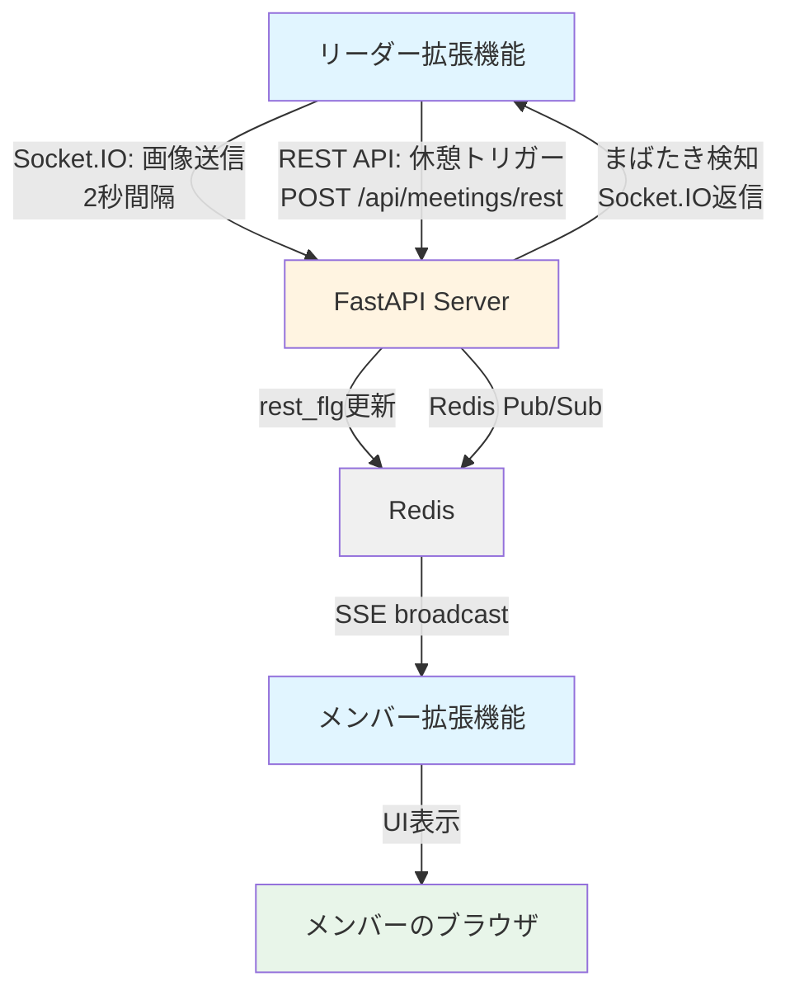
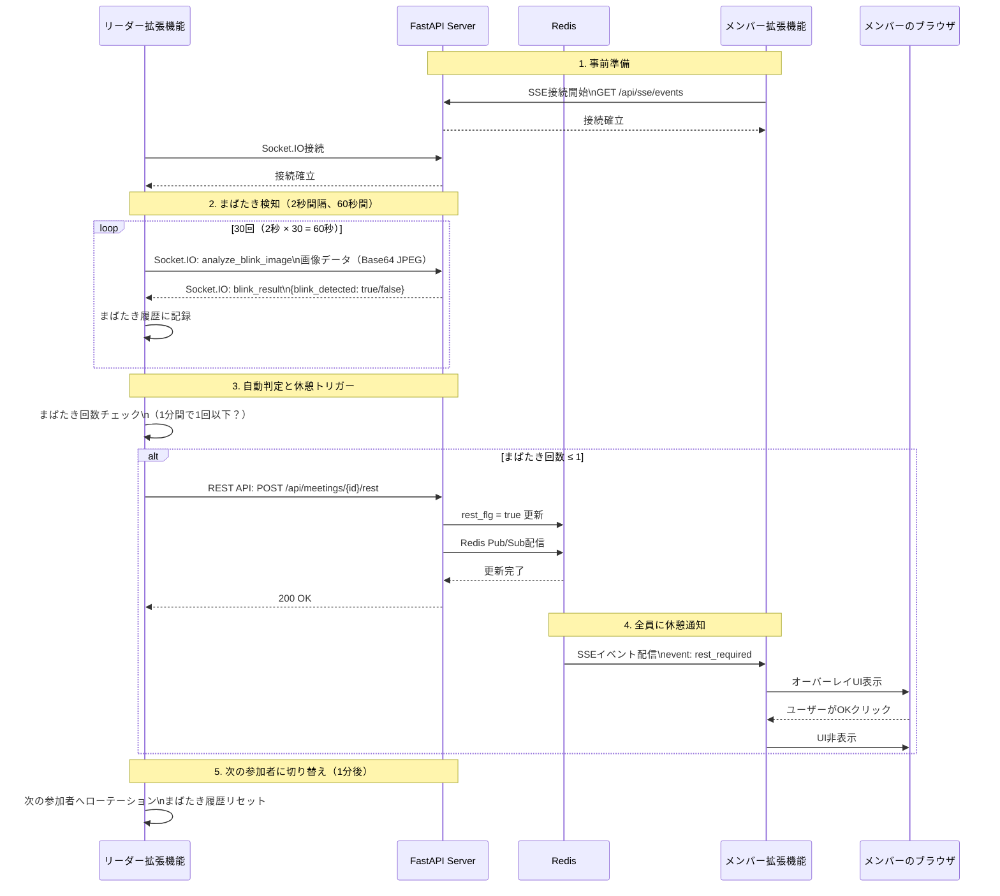

# 会議休憩管理システム要件定義

## 概要
Google Meet会議中に、参加者のまばたきをリアルタイムで検知して疲労度を判定し、適切なタイミングで全メンバーに休憩を促すシステムです。
Socket.IOによるリアルタイム画像送信と、SSEによるブロードキャスト配信を組み合わせたハイブリッド型の通知システムです。

## システム構成



### シーケンス図（まばたき検知フロー）


## 技術スタック
- Chrome Extension Manifest V3
- FastAPI（Python）+ Uvicorn（ASGIサーバー）
- Redis（インメモリDB + Pub/Sub）
- Socket.IO（リアルタイム双方向通信）
  - Transport: Polling（WebSocketは403エラーを避けるため無効化）
  - CORS: 全オリジン許可（`cors_allowed_origins='*'`）
- Server-Sent Events (SSE)（サーバー→クライアント配信）
- Vanilla JavaScript（Content Script）
- シンプルなHTML/CSS（オーバーレイUI）

## ハッカソンスコープ

### 実装する機能（実装済み）
1. ✅ リーダーが参加者のまばたきをリアルタイムで検知（Socket.IO）
   - 2秒間隔で画像キャプチャ
   - Base64 JPEG形式で送信（640x480、品質70%）
   - 1分間で30回の検知を実施
2. ✅ 複数参加者の巡回検知
   - 1分ごとに次の参加者に自動切り替え
   - 全参加者を順番に監視
3. ✅ 自動疲労判定とトリガー
   - 1分間のまばたき回数が1回以下で自動的に休憩フラグを立てる
   - しきい値はカスタマイズ可能
4. ✅ サーバーがrest_flgを更新しRedis Pub/Subで配信
5. ✅ メンバー全員に休憩オーバーレイを表示（SSE経由）
6. ✅ 基本的な会議ID管理
7. ✅ Railway本番環境デプロイ

### 実装しない機能（将来の拡張）
- MediaPipeによる実際のまばたき検知（現在はランダムモック）
- 高度なしきい値判定（機械学習ベース）
- 複数会議の同時管理
- 履歴の長期保存と分析
- 詳細なエラーハンドリング
- 認証・セキュリティ（OAuth等）
- パフォーマンスSLO

## 要件

### 要件 1: リーダー拡張機能（まばたき検知と自動休憩トリガー）
**ユーザーストーリー**: まばたきなどの客観指標で「今、休むべき」を判断し、強制力のある休憩画面で短いブレイクを実行させる。全員に休憩を通知したい。

**受入基準**:
- ✅ Google Meet画面にStart/Stopボタンを表示する
- ✅ Startボタンクリックで以下を実行する:
  1. Socket.IO接続を確立
  2. 2秒間隔で参加者のビデオから画像をキャプチャ
  3. 画像をBase64エンコードしてSocket.IOで送信（`analyze_blink_image`イベント）
  4. サーバーからまばたき検知結果を受信（`blink_result`イベント）
  5. 1分間のまばたき履歴を記録
- ✅ まばたき回数が1回以下の場合、自動的に `POST /api/meetings/{meeting_id}/rest` を送信
- ✅ 1分ごとに次の参加者に切り替え（参加者の巡回監視）
- ✅ まばたき履歴は参加者切り替え時にリセット
- ✅ コンソールに検知状況をログ出力（デバッグ用）

### 要件 2: サーバー側のまばたき検知とSocket.IO通信
**ユーザーストーリー**: システムとして、リーダーから送信された画像を受け取り、まばたき検知結果を返す。

**受入基準**:
- ✅ Socket.IOサーバーを起動する（`socketio.AsyncServer`）
  - CORS: 全オリジン許可（`cors_allowed_origins='*'`）
  - Transport: Polling（WebSocketは無効化）
- ✅ `analyze_blink_image` イベントを受信する
  - データ: `{image: Base64文字列, meeting_id: 文字列, timestamp: ISO8601}`
- ✅ まばたき検知処理を実行する（現在はランダムモック）
- ✅ `blink_result` イベントで結果を返す
  - データ: `{blink_detected: true/false, server_timestamp: ISO8601, client_timestamp: ISO8601, status: 'ok'}`
- ✅ Socket.IOとFastAPIを統合する（`socketio.ASGIApp`）

### 要件 3: サーバー側の休憩管理とブロードキャスト
**ユーザーストーリー**: システムとして、休憩リクエストを受け取り、全員に配信したい。

**受入基準**:
- ✅ `POST /api/meetings/{meeting_id}/rest` でrest_flgをtrueに更新する
- ✅ Redisに更新日時を記録する（TTL: 60分）
- ✅ Redis Pub/Subでイベントを発行する（チャンネル: `meeting:{meeting_id}:rest`）
- ✅ SSE接続中の全クライアントに通知を配信する

### 要件 4: データストア（Redis）
**データ構造**:
```
# 会議のアクティブ状態
キー: meetings:{meeting_id}:active
値: "true" | "false"
TTL: 3時間（10800秒）

# 会議開始時刻
キー: meetings:{meeting_id}:started_at
値: ISO8601形式のタイムスタンプ
TTL: 3時間

# 休憩フラグ
キー: meetings:{meeting_id}:rest_flg
値: "true" | "false"
TTL: 60分（3600秒）

# 休憩開始時刻
キー: meetings:{meeting_id}:rest_started_at
値: ISO8601形式のタイムスタンプ
TTL: 60分

例:
SETEX meetings:abc123:active 10800 "true"
SETEX meetings:abc123:rest_flg 3600 "true"
GET meetings:abc123:rest_flg
```

**Redis Pub/Sub**:
```
# 休憩イベントチャンネル
チャンネル: meeting:{meeting_id}:rest
メッセージ: JSON形式
{
  "event": "rest_required",
  "meeting_id": "abc123",
  "timestamp": "2025-10-17T10:30:00Z",
  "message": "休憩時間です"
}

配信:
PUBLISH meeting:abc123:rest '{"event":"rest_required",...}'
購読:
SUBSCRIBE meeting:abc123:rest
パターン購読:
PSUBSCRIBE meeting:*:rest
```

**Redis接続情報**:
- デフォルト: localhost:6379
- 環境変数で設定可能（REDIS_HOST, REDIS_PORT, REDIS_PASSWORD）

### 要件 5: SSEによるリアルタイム配信
**ユーザーストーリー**: システムとして、休憩通知をリアルタイムで配信したい。

**受入基準**:
- ✅ `GET /api/sse/events?meeting_id={id}` でSSE接続を確立する
- ✅ Redis Pub/Subを購読する（`meeting:{meeting_id}:rest`）
- ✅ 接続確立時にメッセージを送信:
```json
{
  "event": "connected",
  "data": {
    "meeting_id": "abc123",
    "timestamp": "2025-10-17T10:30:00Z"
  }
}
```
- ✅ Redis Pub/Subから休憩イベントを受信したら配信:
```json
{
  "event": "message",
  "data": {
    "event": "rest_required",
    "meeting_id": "abc123",
    "timestamp": "2025-10-17T10:30:00Z",
    "message": "休憩時間です"
  }
}
```
- ✅ ハートビート（30秒間隔）を実装する:
```json
{
  "event": "heartbeat",
  "data": {
    "timestamp": "2025-10-17T10:30:00Z"
  }
}
```

### 要件 6: メンバー拡張機能（UI表示）
**ユーザーストーリー**: 会議メンバー全員に、休憩させる。

**受入基準**:
- ✅ `rest_required`イベントを受信したらオーバーレイUIを表示する
- ✅ オーバーレイには以下を含む:
  - 半透明背景
  - 「休憩時間です」メッセージ
  - 「OK」ボタン
  - 「休憩希望を送る」ボタン（匿名で全員に休憩通知）
- ✅ OKボタンクリックでフェードアウトして非表示にする
- ✅ 休憩希望ボタンクリックで `POST /api/meetings/{meeting_id}/rest-request` を送信


## 追加検討事項（時間があれば）
- プライバシーの観点対応（画像データの取り扱い）
- オンラインミーティングで途中抜け等の場合の処理考える
- MediaPipeによる実際のまばたき検知実装
- まばたき検知の精度向上（機械学習モデルの導入）
- 複数会議の同時管理
- 履歴の長期保存と分析機能

## 成功基準
- ✅ 5人の参加者で同時にテストして正常動作する
- ✅ 基本的なエラー（サーバーダウン等）で致命的なクラッシュが発生しない
- ✅ Socket.IO接続が安定して動作する（CORS、Polling transport）
- ✅ 1分ごとの参加者ローテーションが正常に動作する
- ✅ まばたき検知結果が正しく記録される
- ✅ 自動休憩トリガーが正常に発火する（しきい値: 1回以下）
- ✅ SSE経由で全メンバーに休憩通知が届く
- ✅ Railway本番環境で安定して動作する
