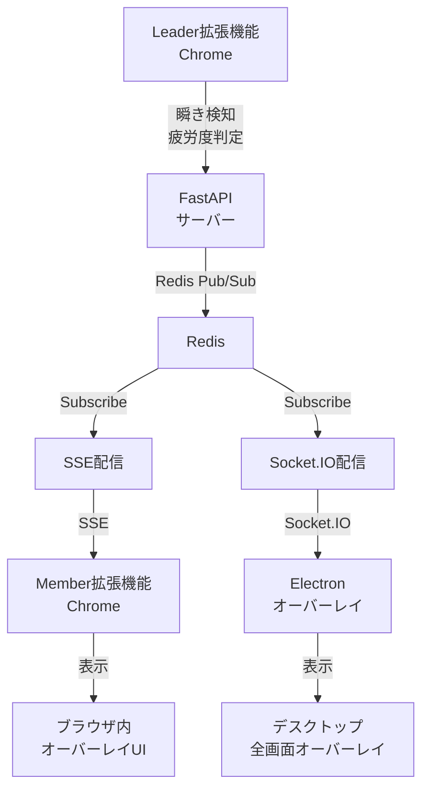

# JPHACKS 2025 中間発表資料

## カテゴリ

**Health（ヘルステック）** - Health × Technology

## プロダクト名

# ひとやすみ通信

> **～ リモートワークで忙しいあなたへ ～**


---

## アイデア概要

### 課題

長時間のオンライン会議で疲労が蓄積しても、個人の判断で休憩を取りづらい。
結果、**会議の生産性が低下**してしまう。

### 解決策

Google Meet会議中に参加者の**疲労度を自動検知**し、
全メンバーに対して一斉に休憩通知を送る**リアルタイムシステム**。

### 主要機能

1. 🔍 **リーダーが瞬き数を検知して疲労度を自動判定**
2. 📡 **Server-Sent Events (SSE)で全メンバーに同時配信**
3. 🎨 **美しいオーバーレイUIで画面全体を覆い、強制的に休憩を促す**
4. 💻 **Electronデスクトップアプリでブラウザ外でも通知**

### 特徴

- ✅ 全員同時休憩で気兼ねなく休める
- ✅ リアルタイム通信で即座に通知
- ✅ ブラウザ内+デスクトップ両方でカバー

---

## 使用技術

### プログラミング言語

- **Python** 3.11+
- **JavaScript** (ES6+)

### フレームワーク・ライブラリ

| 技術 | 用途 |
|------|------|
| **FastAPI** | Pythonバックエンド |
| **Chrome Extension Manifest V3** | ブラウザ拡張機能 |

### リアルタイム通信

- **Server-Sent Events (SSE)** - ブラウザへのリアルタイム配信
- **Socket.IO** - WebSocketベースの双方向通信
- **Redis Pub/Sub** - イベント配信基盤

### データベース

- **Redis** - インメモリKVS（Key-Value Store）

### インフラ・デプロイ

- **Docker & Docker Compose** - コンテナ化
- **Railway** - 本番環境デプロイ

### その他の技術

- **Native Messaging** - Chrome ⇔ Electron連携
- **sse-starlette** - SSE実装ライブラリ

### 活用予定技術（今後）

- **MediaPipe Face Mesh** - 高精度瞬き検知

---

## システムアーキテクチャ



### フロー図（テキスト版）

```
[Leader拡張機能（Chrome）]
    ↓ 瞬き検知 → 疲労度判定
    ↓ POST /api/meetings/{id}/rest

[FastAPIサーバー]
    ↓ Redis Pub/Sub でイベント配信
    ├→ [SSE] → [Member拡張機能（Chrome）] → ブラウザ内オーバーレイ
    └→ [Socket.IO] → [Electronアプリ] → デスクトップ全画面オーバーレイ

[Redis]
    - 会議状態の管理
    - リアルタイムイベント配信
```

---

## 独自技術のアピールポイント

### 1. 🔗 シームレスな連携

Chrome拡張機能 ⇔ FastAPIサーバー ⇔ Electronアプリを
**Native Messaging** と **Socket.IO** で完全統合

### 2. 📱 二重のオーバーレイシステム

- **ブラウザ内**: SSE経由で即座に通知
- **デスクトップ**: Socket.IO経由で全画面表示

→ **どこで作業していても確実に休憩を促す**

### 3. ⚡ リアルタイム同期休憩

Redis Pub/Sub を活用し、全メンバーに同時配信
→ **チーム全体で一斉に休憩できる**

### 4. 🎯 強制力のあるUX

画面全体を覆うオーバーレイUI
→ **確実に休憩を取らせる仕組み**

---

## 今後の展望

- 🎥 **MediaPipe Face Mesh統合**による高精度瞬き検知
- 📊 **個人別疲労度ダッシュボード**
- 💬 **Slack/Discord通知連携**
- 📈 **会議品質レポート機能**（疲労度推移グラフ）

---

## プロジェクト情報

| 項目 | 内容 |
|------|------|
| **作成日** | 2025-10-18 |
| **チーム** | JPHACKS 2025 |
| **リポジトリ** | https://github.com/jphacks/os_2521 |

---

## 60秒発表用スクリプト

### 1. オープニング（5秒）
「HealthTechカテゴリの**ひとやすみ通信**です。」

### 2. 課題と解決策（15秒）
「オンライン会議の疲労問題を、瞬き検知による自動判定と全員同時休憩で解決します。」

### 3. 主要機能（20秒）
「FastAPIとRedisによるリアルタイム配信、SSEとSocket.IOの二重通信で、ブラウザ内とデスクトップ両方にオーバーレイUIを表示し、確実に休憩を促します。」

### 4. 技術アピール（15秒）
「Chrome拡張機能、FastAPI、Electron、Native Messagingを組み合わせた独自アーキテクチャで、シームレスな連携を実現しました。」

### 5. クロージング（5秒）
「チームの健康と生産性を両立する、新しい会議体験をお届けします。」
